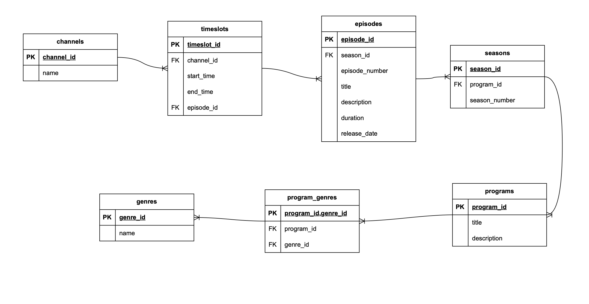

# テーブル設計
## ER図

## テーブル定義
`チャンネル：channels`
|カラム名|データ型|NULL|キー|初期値|AUTO INCREMENT|
|---|---|---|---|---|---|
|id|int||primary||yes|
|name|varchar(100)||||

`ジャンル：genres`
|カラム名|データ型|NULL|キー|初期値|AUTO INCREMENT|
|---|---|---|---|---|---|
|id|int||primary||yes|
|name|varchar(100)||||

`番組：programs`
|カラム名|データ型|NULL|キー|初期値|AUTO INCREMENT|
|---|---|---|---|---|---|
|id|int||primary||yes|
|title|varchar(100)|||||
|description|varchar(100)|||||

・ユニークキー制約：titleカラムに対して設定

`番組ジャンル：program_genres`
|カラム名|データ型|NULL|キー|初期値|AUTO INCREMENT|
|---|---|---|---|---|---|
|program_id|int||primary|||
|genre_id|int||primary|||

・外部キー制約：program_idに対して、programsテーブルのidカラムから設定 
・外部キー制約：genre_idに対して、genresテーブルのidカラムから設定

`シーズン：seasons`
|カラム名|データ型|NULL|キー|初期値|AUTO INCREMENT|
|---|---|---|---|---|---|
|id|int||primary||yes|
|program_id|int|||||
|season_number|int|||||

・外部キー制約：program_idに対して、programsテーブルのidカラムから設定

`エピソード：episodes`
|カラム名|データ型|NULL|キー|初期値|AUTO INCREMENT|
|---|---|---|---|---|---|
|id|int||primary||yes|
|season_id|int|yes||||
|program_id|int|||||
|episode_number|int|yes|||
|title|varchar(100)|||||
|description|varchar(100)|||||
|duration|int|yes||||
|release_date|date|yes||||

・外部キー制約：season_idに対して、seasonsテーブルのidカラムから設定 
・外部キー制約：program_idに対して、programsテーブルのidカラムから設定

`番組枠：timeslots`
|カラム名|データ型|NULL|キー|初期値|AUTO INCREMENT|
|---|---|---|---|---|---|
|id|int||primary||yes|
|channel_id|int||||
|program_id|int||||
|start_time|int||||
|end_time|int||||

・外部キー制約：channel_idに対して、channelsテーブルのidカラムから設定 
・外部キー制約：program_idに対して、programsテーブルのidカラムから設定

`視聴数：view_counts`
|カラム名|データ型|NULL|キー|初期値|AUTO INCREMENT|
|---|---|---|---|---|---|
|timeslot_id|int||primary||yes|
|episode_id|int||primary|||
|views|int|||0||

・外部キー制約：timeslot_idに対して、timeslotsテーブルのidカラムから設定 
・外部キー制約：episode_idに対して、episodesテーブルのidカラムから設定

